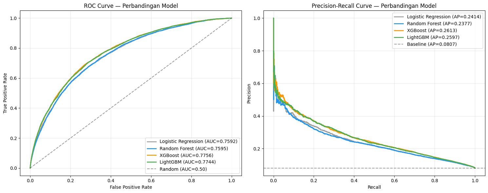
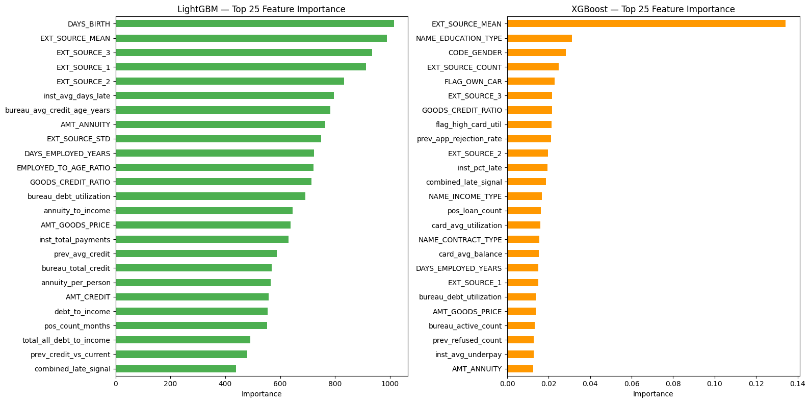
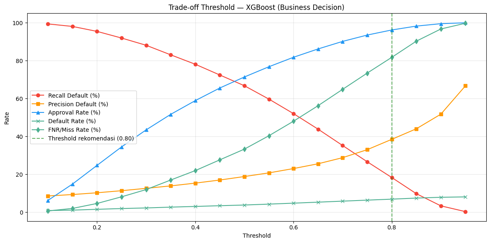
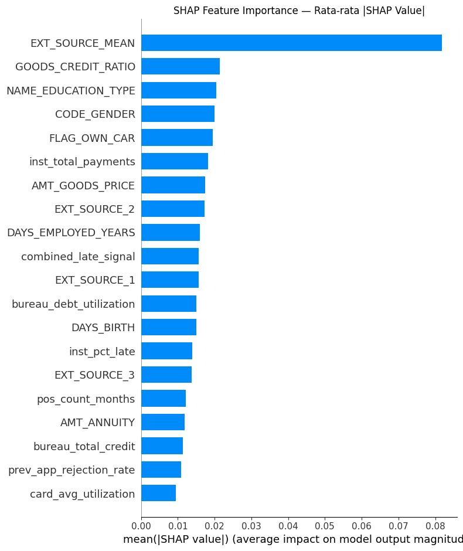
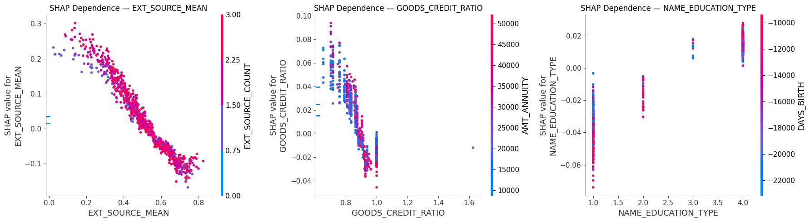
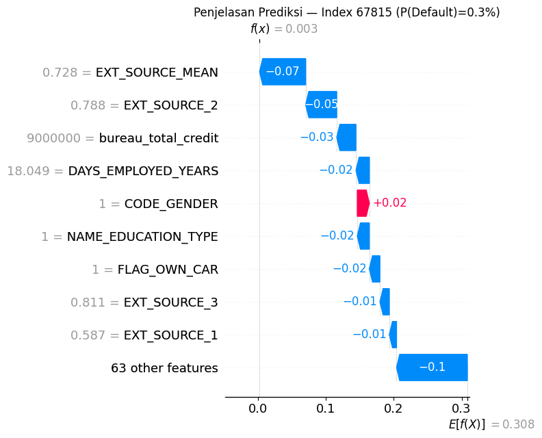

# 🏦 End-to-End Credit Risk Modeling Engine (AWS Cloud-Native)

[](https://aws.amazon.com/)
[](https://spark.apache.org/)
[](https://github.com/shap/shap)
[-red?style=flat-square)](https://www.ojk.go.id/)
[](https://www.python.org/)
[](LICENSE)

---

##  Daftar Isi

- [Ringkasan Eksekutif](#1-ringkasan-eksekutif)
- [Struktur Repositori](#2-struktur-repositori)
- [Spesifikasi & Dependensi](#3-spesifikasi--dependensi)
- [Arsitektur Data Pipeline](#4-arsitektur-data-pipeline-medallion)
- [Panduan Menjalankan Pipeline](#5-panduan-menjalankan-pipeline)
- [Strategi Anti-Leakage & Robustness](#6-strategi-anti-leakage--robustness)
- [Pemodelan & Benchmarking](#7-pemodelan--benchmarking)
- [Kepatuhan OJK & Explainability (SHAP)](#8-kepatuhan-ojk--explainability-shap)
- [Dampak Bisnis & Roadmap](#9-dampak-bisnis--roadmap)

---

## Demo Streamlit : https://demo-credit-risk.streamlit.app/

## 1. Ringkasan Eksekutif

Proyek ini mengimplementasikan sistem **otomatisasi penilaian risiko kredit** (*Innovative Credit Scoring*) berskala *enterprise* dengan arsitektur **cloud-native AWS**. Menggunakan basis data terdistribusi bertumpu pada **Arsitektur Medallion**, sistem ini melakukan pembersihan data, rekayasa fitur finansial tingkat lanjut, hingga pelatihan model ansambel prediktif guna memitigasi angka **Non-Performing Loan (NPL)** atau Tingkat Wanprestasi (TWP90).

Untuk memenuhi standar regulasi **Otoritas Jasa Keuangan (OJK)** Indonesia (**POJK No. 10/POJK.05/2022**), proyek ini mengintegrasikan metode **Explainable AI (XAI)** berbasis **SHAP** untuk meruntuhkan sifat *black-box* model kompleks (XGBoost/LightGBM), memberikan jaminan akuntabilitas, dan menyediakan transparansi alasan keputusan penolakan/penerimaan kredit bagi setiap aplikasi nasabah.

### ✨ Highlight Utama

| Aspek | Detail |
|---|---|
| **Cloud Platform** | AWS S3, AWS Glue (PySpark), AWS SageMaker |
| **Data Architecture** | Medallion (Bronze → Silver → Gold) |
| **Sumber Data** | 8 tabel relasional (aplikasi, biro kredit, cicilan, kartu kredit, POS) |
| **Total Fitur Gold** | 60+ fitur rekayasa domain finansial |
| **Model Ensemble** | Logistic Regression, Random Forest, XGBoost, LightGBM |
| **Metrik Evaluasi** | ROC-AUC (primary), Precision-Recall, F1-Score |
| **KPI Bisnis** | Approval Rate ≥ 70% & Default Rate ≤ 7% |
| **Model Terpilih** | XGBoost (ROC-AUC: 0.7756, PR-AUC: 0.2613) |
| **Decision Threshold** | 0.80 → Approval Rate 96.16%, Default Rate 6.86% |
| **Explainability** | SHAP Global + Local Waterfall Plot per Nasabah |
| **Regulasi** | OJK POJK No. 10/POJK.05/2022 Compliant |

---

## 2. Struktur Repositori

```
credit-risk-modeling/
│
├── data/
│   └── data_dictionary.xlsx          # Kamus data: domain knowledge & logika fitur ETL
│
├── src/
│   ├── etl/
│   │   ├── credit-risk-silver-etl.py # AWS Glue Job: pembersihan & agregasi per nasabah
│   │   └── credit-risk-gold-etl.py   # AWS Glue Job: feature engineering lanjutan
│   │
│   └── modeling/
│       └── credit_risk_modeling_sagemaker__SHAP.ipynb  # SageMaker: training & SHAP
│
├── requirements.txt                  # Dependensi Python
├── .gitignore                        # Proteksi kredensial & data mentah
└── README.md                         # Dokumentasi utama (file ini)
```

---

## 3. Spesifikasi & Dependensi

### Prasyarat Infrastruktur

| Komponen | Versi Minimum | Keterangan |
|---|---|---|
| Python | 3.10+ | Runtime utama |
| Apache Spark | 3.3+ | Untuk menjalankan ETL Glue |
| AWS CLI | Latest | Dikonfigurasi dengan akses S3 |
| AWS Glue | G.2X Worker | Untuk ETL terdistribusi |
| AWS SageMaker | Python 3.10 Kernel | Untuk modeling & SHAP |

### Library Python (`requirements.txt`)

```
pyarrow>=15.0.0
pandas>=2.1.0
scikit-learn>=1.4.0
xgboost>=3.0.0
lightgbm>=4.3.0
imbalanced-learn>=0.12.0
s3fs>=2024.2.0
fsspec>=2024.2.0
matplotlib>=3.7.0
seaborn>=0.12.0
shap>=0.46.0
ipywidgets>=8.0.0
```

> **⚠️ Catatan Versi Kritis:**
> - `xgboost>=3.0.0` — Diperlukan untuk penanganan string eksponensial ilmiah yang benar.
> - `shap>=0.46.0` — Diperlukan untuk kompatibilitas tipe data objek `Explanation`.
> - Jangan downgrade dua library ini; akan menyebabkan bug tipe data yang sulit di-debug.

**Instalasi:**
```bash
pip install -r requirements.txt
```

---

## 4. Arsitektur Data Pipeline (Medallion)

```
[00-Raw Data (S3 CSV)]
        │
        ▼
[01-Bronze Layer]          ← Data mentah tersimpan as-is di S3
        │
        ▼
[02-Silver Layer]          ← credit-risk-silver-etl.py (AWS Glue)
   Agregasi per nasabah (SK_ID_CURR)
   Koreksi sentinel values (DAYS_EMPLOYED=365243)
   Rekayasa fitur dasar: debt_to_income, annuity_to_income, dll.
        │
        ▼
[03-Gold Layer]            ← credit-risk-gold-etl.py (AWS Glue)
   Interaksi antar-tabel: combined_late_signal, total_all_debt_to_income
   Binning risiko: dti_risk_bin, credit_age_bin
   Flag risiko: flag_high_risk_profile, flag_no_credit_history
        │
        ▼
[SageMaker Modeling]       ← credit_risk_modeling_sagemaker__SHAP.ipynb
   Training 4 model → Evaluasi ROC-AUC → SHAP Explainability
```

### Sumber Data (8 Tabel Input)

| Tabel | Domain Knowledge | Fitur Kunci yang Dihasilkan |
|---|---|---|
| `application_train/test` | Pendapatan vs hutang | `debt_to_income`, `annuity_to_income`, `EXT_SOURCE_MEAN` |
| `bureau` | Riwayat kredit biro eksternal | `bureau_total_loans`, `bureau_avg_credit_age_years`, `bureau_debt_utilization` |
| `bureau_balance` | Status bulanan kredit biro | `bureau_avg_bb_dpd_rate`, `bureau_total_bb_dpd_months` |
| `installments_payments` | Disiplin cicilan | `inst_pct_late`, `inst_avg_days_late`, `inst_avg_underpay` |
| `credit_card_balance` | Utilisasi kartu kredit | `card_avg_utilization`, `card_max_utilization` |
| `previous_application` | Riwayat penolakan | `prev_app_rejection_rate`, `prev_avg_credit` |
| `POS_CASH_balance` | Beban pinjaman POS | `pos_pct_dpd`, `pos_max_dpd` |

---

## 5. Panduan Menjalankan Pipeline

### Step 1 — Persiapan S3 Bucket

Upload semua file CSV sumber ke S3 dengan struktur berikut:

```
s3://your-bucket-name/00-raw/credit-risk-checker/
├── application_train.csv
├── application_test.csv
├── bureau.csv
├── bureau_balance.csv
├── installments_payments.csv
├── previous_application.csv
├── credit_card_balance.csv
└── POS_CASH_balance.csv
```

Update variabel `BUCKET` di kedua file ETL:
```python
BUCKET = "s3://your-bucket-name/"
```

### Step 2 — Jalankan Silver ETL (AWS Glue)

1. Buka **AWS Glue Console** → Jobs → Create Job
2. Upload `src/etl/credit-risk-silver-etl.py` sebagai script
3. Worker type: **G.2X**, Number of workers: **10**
4. Run job → output tersimpan di `02-silver/train_features_v4/` dan `02-silver/test_features_v4/`

### Step 3 — Jalankan Gold ETL (AWS Glue)

1. Buat job Glue baru dengan `src/etl/credit-risk-gold-etl.py`
2. Worker type: **G.1X**, Number of workers: **5** (data sudah teragregasi, lebih ringan)
3. Run job → output tersimpan di `03-gold/train_features_gold/` dan `03-gold/test_features_gold/`

### Step 4 — Modeling di SageMaker

1. Buka **Amazon SageMaker** → Notebook Instances → buat instance (ml.m5.xlarge cukup untuk eksperimen)
2. Upload `src/modeling/credit_risk_modeling_sagemaker__SHAP.ipynb`
3. Pilih kernel: **Python 3 (Data Science)**
4. Jalankan semua cell secara berurutan
5. SHAP Waterfall Plot per nasabah dihasilkan di akhir notebook

---

## 6. Strategi Anti-Leakage & Robustness

Sistem ini dirancang dengan prinsip **Robustness Engineering** tinggi:

###  Zero Data Leakage
Rekayasa fitur diisolasi penuh secara independen antara set data **Train** dan **Test** sejak tahap pengolahan data mentah. Tidak ada informasi dari test set yang bocor ke proses fitting transformer.

###  Perlindungan Data Produksi (Anti-Crash)
```python
# Contoh konfigurasi OrdinalEncoder yang aman untuk produksi
OrdinalEncoder(
    handle_unknown='use_encoded_value',
    unknown_value=-1  # Label kategori baru tidak menyebabkan crash
)
```

### 🔄 Sinkronisasi StringIndexer (AWS Glue)
Pipeline `StringIndexer` di AWS Glue di-**fit** hanya pada data Train, kemudian di-**transform** ke Test. Ini menghindari asimetri representasi angka antar-lingkungan data.

###  Koreksi Sentinel Value
```python
# DAYS_EMPLOYED = 365243 adalah kode sentinel untuk "pengangguran", bukan nilai nyata
.withColumn("IS_UNEMPLOYED",
    F.when(F.col("DAYS_EMPLOYED") == 365243, 1).otherwise(0))
```

###  Koreksi Nilai 0 Palsu (Gold Layer)
Kolom seperti `bureau_avg_credit_age_years` dan `inst_avg_days_late` yang bernilai `0` akibat `fillna` agresif di layer sebelumnya dikonversi kembali ke `NULL` di Gold Layer agar tidak menyesatkan model.

---

## 7. Pemodelan & Benchmarking

### Arsitektur Model yang Diuji

| Model | Tipe | Kelebihan Utama |
|---|---|---|
| **Logistic Regression** | Linear | Interpretable, baseline referensi |
| **Random Forest** | Ensemble (Bagging) | Robust terhadap outlier, feature importance |
| **XGBoost** | Ensemble (Boosting) | State-of-the-art, optimasi komputasi tinggi |
| **LightGBM** | Ensemble (Boosting) | Super cepat, efisien memori via histogram |

### Metrik Evaluasi

- **Primary**: ROC-AUC (Area Under the Receiver Operating Characteristic Curve)
- **Secondary**: Precision, Recall, F1-Score, Average Precision (PR-AUC)



### Hasil Benchmarking Model

| Model | ROC-AUC | PR-AUC |
|---|---|---|
| **XGBoost** ⭐ | **0.7756** | **0.2613** |



> XGBoost dipilih sebagai model produksi berdasarkan performa ROC-AUC tertinggi di antara semua kandidat model yang diuji.

### KPI Bisnis & Penetapan Decision Threshold

Sistem menggunakan dua KPI bisnis utama yang harus **dipenuhi secara bersamaan**:

| KPI | Target |
|---|---|
| **Approval Rate** | ≥ 70% |
| **Default Rate** | ≤ 7% |

Threshold dipilih dengan cara memindai seluruh rentang nilai probabilitas dan menemukan threshold paling konservatif (paling ketat) yang masih memenuhi **kedua** kondisi KPI di atas secara bersamaan.

#### Analisis Threshold Lengkap — XGBoost



| Threshold | Recall Default | Precision Default | Approval Rate (%) | Default Rate (%) | FNR/Miss Rate (%) | Memenuhi KPI? |
|---|---|---|---|---|---|---|
| 0.10 | 99.36 | 8.55 | 6.19 | 0.84 | 0.64 | ❌ Approval terlalu rendah |
| 0.15 | 98.03 | 9.29 | 14.83 | 1.07 | 1.97 | ❌ Approval terlalu rendah |
| 0.20 | 95.41 | 10.23 | 24.70 | 1.50 | 4.59 | ❌ Approval terlalu rendah |
| 0.25 | 91.90 | 11.32 | 34.46 | 1.90 | 8.10 | ❌ Approval terlalu rendah |
| 0.30 | 88.08 | 12.57 | 43.44 | 2.22 | 11.92 | ❌ Approval terlalu rendah |
| 0.35 | 83.04 | 13.86 | 51.63 | 2.65 | 16.96 | ❌ Approval terlalu rendah |
| 0.40 | 78.07 | 15.32 | 58.87 | 3.01 | 21.93 | ❌ Approval terlalu rendah |
| 0.45 | 72.39 | 16.96 | 65.54 | 3.40 | 27.61 | ❌ Approval terlalu rendah |
| 0.50 | 66.73 | 18.80 | 71.35 | 3.76 | 33.27 | ✅ |
| 0.55 | 59.66 | 20.73 | 76.77 | 4.24 | 40.34 | ✅ |
| 0.60 | 52.00 | 23.01 | 81.76 | 4.74 | 48.00 | ✅ |
| 0.65 | 43.81 | 25.53 | 86.15 | 5.27 | 56.19 | ✅ |
| 0.70 | 35.17 | 28.76 | 90.13 | 5.81 | 64.83 | ✅ |
| 0.75 | 26.61 | 32.97 | 93.48 | 6.34 | 73.39 | ✅ |
| **0.80** ⭐ | **18.29** | **38.43** | **96.16** | **6.86** | **81.71** | ✅ **THRESHOLD TERPILIH** |
| 0.85 | 9.75 | 44.00 | 98.21 | 7.42 | 90.25 | ❌ Default rate melewati 7% |
| 0.90 | 3.32 | 51.72 | 99.48 | 7.85 | 96.68 | ❌ Default rate melewati 7% |
| 0.95 | 0.28 | 66.67 | 99.97 | 8.05 | 99.72 | ❌ Default rate melewati 7% |

#### ✅ Threshold Terpilih: **0.80**

Threshold **0.80** adalah nilai paling konservatif (paling ketat dalam menyeleksi risiko) yang **masih memenuhi kedua KPI bisnis secara bersamaan**:

| Metrik | Nilai | Status |
|---|---|---|
| Approval Rate | 96.16% | ✅ ≥ 70% |
| Default Rate | 6.86% | ✅ ≤ 7% |
| Recall Default | 18.29% | — |
| Precision Default | 38.43% | — |
| FNR / Miss Rate | 81.71% | — |

> **Catatan Interpretasi**: Pada threshold 0.80, model hanya menyetujui aplikasi ketika probabilitas default sangat rendah (< 20%). Ini menghasilkan Approval Rate tinggi (96.16%) karena sebagian besar nasabah memang bukan peminjam berisiko tinggi, sekaligus menjaga Default Rate di bawah batas 7%.

### Strategi Ketimpangan Kelas (Class Imbalance)

Data kredit secara alami timpang — mayoritas nasabah berstatus lancar (label 0). Strategi yang diterapkan:

```python
# Hitung scale_pos_weight proporsional
neg_count = (y_train == 0).sum()
pos_count = (y_train == 1).sum()
scale_pos_weight = neg_count / pos_count

XGBClassifier(scale_pos_weight=scale_pos_weight, ...)
LGBMClassifier(scale_pos_weight=scale_pos_weight, ...)
```

---

## 8. Kepatuhan OJK & Explainability (SHAP)

### Latar Belakang Regulasi

Berdasarkan **POJK No. 10/POJK.05/2022** tentang Layanan Pendanaan Bersama Berbasis Teknologi Informasi, lembaga keuangan diwajibkan untuk dapat menjelaskan alasan keputusan kredit secara transparan dan akuntabel. Model *black-box* seperti XGBoost tidak dapat digunakan tanpa mekanisme penjelasan yang memadai.

### Solusi: SHAP (SHapley Additive exPlanations)

SHAP menghitung kontribusi setiap fitur terhadap prediksi individual berdasarkan teori permainan kooperatif Shapley.

#### Global Interpretability — Fitur Makro



```python
shap.summary_plot(shap_values, X_test, plot_type="bar")
```

Manajemen risiko dapat memahami **fitur apa yang paling mendominasi** keputusan mesin secara keseluruhan (misalnya: `EXT_SOURCE_MEAN`, `combined_late_signal`, `bureau_debt_utilization`).




#### Local Interpretability — Penjelasan Per Nasabah



```python
# Fungsi produksi untuk scoring real-time
def explain_applicant(applicant_index):
    shap.plots.waterfall(shap_values[applicant_index])
```

**Nasabah Risiko Tinggi** — Sistem mengidentifikasi faktor pendorong utama (contoh: lonjakan `combined_late_signal`) yang menaikkan probabilitas gagal bayar melewati ambang batas.

**Nasabah Risiko Rendah** — Sistem menampilkan faktor kekuatan finansial yang berhasil menekan angka risiko hingga pengajuan layak disetujui otomatis.

---

## 9. Dampak Bisnis & Roadmap

###  Dampak Saat Ini

| Dimensi | Dampak |
|---|---|
| **Akurasi Risiko** | ROC-AUC tinggi menggantikan metode penilaian manual yang subjektif |
| **Efisiensi Operasional** | Turnaround time analisis kredit dipangkas signifikan |
| **Audit & Compliance** | SHAP memungkinkan audit model yang transparan sesuai POJK |
| **Skalabilitas** | PySpark di AWS Glue memproses jutaan baris secara paralel |

###  Roadmap Pengembangan

- **Fairness & Etika Data**: Menghapus variabel sensitif seperti `CODE_GENDER` untuk memastikan keputusan kredit bebas bias diskriminasi, sesuai UU Perlindungan Data Pribadi (UU PDP).
- **Model Monitoring**: Implementasi kalkulasi **Population Stability Index (PSI)** secara berkala di S3 produksi untuk mendeteksi *data drift* (pergeseran karakteristik populasi nasabah baru).
- **Real-Time Scoring API**: Membungkus model terbaik ke dalam endpoint **SageMaker Inference** untuk scoring aplikasi real-time.
- **Feature Store**: Migrasi fitur-fitur Gold ke **AWS Feature Store** agar dapat digunakan lintas tim dan proyek.
- **AutoML Benchmarking**: Eksperimen tambahan dengan **AutoGluon** atau **H2O AutoML** sebagai referensi perbandingan.

---

##  Lisensi

Proyek ini tersedia di bawah lisensi [MIT](LICENSE).

---

##  Tentang Pengembang

**Sentot Ali Basah**
Domain Keahlian: Data Science · Credit Risk Analytics · Cloud Data Engineering (AWS)

